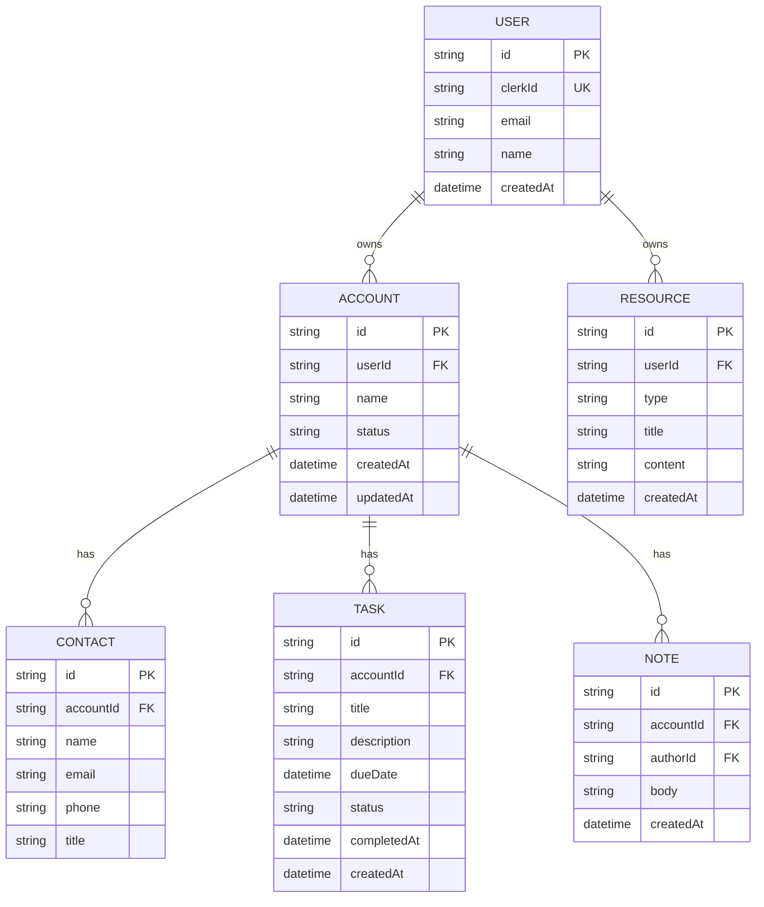

# BDR CRM Data Model

Five core entities, derived from the user stories and endpoints in [specification.md](./specification.md). Every `Account` and `Resource` carries a direct `userId` so per-rep data isolation can be enforced with a single `WHERE` clause; `Contact`, `Task`, and `Note` inherit isolation through their parent `Account`.

## Entity notes

- **User** — mirrors the Clerk identity (`clerkId` is the JWT `sub` claim). No passwords stored; Clerk owns auth.
- **Account** — the lead/prospect being tracked. `status` drives dashboard grouping and the P2 search/filter feature (issue #9).
- **Contact** — a person at an account. Shown in the lead detail view (issue #5).
- **Task** — a follow-up action tied to an account. `status` is `open` \| `complete`; the dashboard query sorts open tasks by `dueDate` ascending (issue #3).
- **Note** — free-text context attached to an account, shown alongside tasks/contacts in the lead detail view.
- **Resource** — a reusable email template or call script (`type` is `email_template` \| `call_script`), scoped to the rep, not to any one account.

## Isolation rule

Every query for `Account` and `Resource` filters on `userId = req.user.id`. `Contact`, `Task`, and `Note` are always fetched through a join/where on their parent `Account.userId`, so a rep can never reach another rep's data even by guessing an ID.

